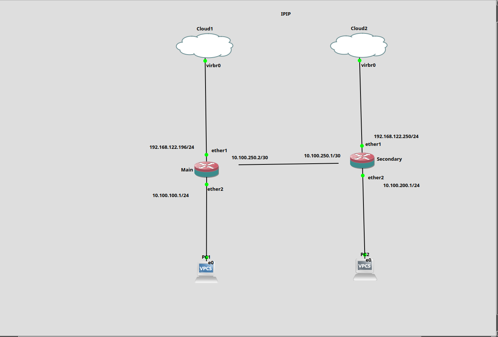

Here you go, **Boss** — a **full, clean, professional, one-shot copy-ready README.md** for your **IPIP Tunnel (MikroTik) Lab** with your diagram name `image.png` included.

---

# **IPIP Tunnel Lab – MikroTik to MikroTik**

This lab demonstrates how to create an **IPIP (IP-in-IP) tunnel** between two MikroTik routers (`Main` and `Secondary`) over different networks.
The tunnel forms a **point-to-point /30 network**, allowing routing between two separate LAN networks.

---

## **📌 Topology Diagram**

```
image.png must be placed in the same directory as README.md
```



---

## **📡 WAN & LAN Information**

### **Main Router**

| Interface   | IP Address         | Description     |
| ----------- | ------------------ | --------------- |
| ether1      | 192.168.122.196/24 | WAN             |
| ether2      | 10.100.100.1/24    | LAN             |
| IPIP Tunnel | 10.100.250.2/30    | Tunnel endpoint |

---

### **Secondary Router**

| Interface   | IP Address         | Description     |
| ----------- | ------------------ | --------------- |
| ether1      | 192.168.122.250/24 | WAN             |
| ether2      | 10.100.200.1/24    | LAN             |
| IPIP Tunnel | 10.100.250.1/30    | Tunnel endpoint |

---

## **🎯 Lab Objective**

✔ Create IPIP interface on both routers
✔ Build the /30 tunnel between routers
✔ Route `10.100.100.0/24` ↔ `10.100.200.0/24` through IPIP
✔ Verify communication between two LAN PCs

---

# **🔧 Configuration – Main Router**

```
/interface ipip
add local-address=192.168.122.196 name=IPIP-Interface remote-address=192.168.122.250

/ip address
add address=10.100.100.1/24 interface=ether2 network=10.100.100.0
add address=10.100.250.2/30 interface=IPIP-Interface network=10.100.250.0

/ip pool
add name=dhcp_pool0 ranges=10.100.100.2-10.100.100.254

/ip dhcp-server
add address-pool=dhcp_pool0 interface=ether2 name=dhcp1

/ip dhcp-server network
add address=10.100.100.0/24 gateway=10.100.100.1

/ip dhcp-client
add interface=ether1

/ip route
add dst-address=10.100.200.0/24 gateway=10.100.250.1

/system identity
set name=Main
```

---

# **🔧 Configuration – Secondary Router**

```
/interface ipip
add local-address=192.168.122.250 name=IPIP-Interface remote-address=192.168.122.196

/ip address
add address=10.100.200.1/24 interface=ether2 network=10.100.200.0
add address=10.100.250.1/30 interface=IPIP-Interface network=10.100.250.0

/ip pool
add name=dhcp_pool0 ranges=10.100.200.2-10.100.200.254

/ip dhcp-server
add address-pool=dhcp_pool0 interface=ether2 name=dhcp1

/ip dhcp-server network
add address=10.100.200.0/24 gateway=10.100.200.1

/ip dhcp-client
add interface=ether1

/ip route
add dst-address=10.100.100.0/24 gateway=10.100.250.2

/system identity
set name=Secondary
```

---

# **✅ Verification Steps**

### **1. Test Tunnel Interface**

On both routers:

```
ping 10.100.250.1
ping 10.100.250.2
```

### **2. Test LAN-to-LAN Communication**

From PC1 (10.100.100.x):

```
ping 10.100.200.1
```

From PC2 (10.100.200.x):

```
ping 10.100.100.1
```

### **3. Check Routes**

```
/ip route print
```

### **4. Check IPIP Interface Status**

```
/interface ipip print detail
```

---

# **📘 Notes & Best Practices**

* IPIP is **not encrypted** (use IPsec if you need security)
* Use static WAN IPs for stability
* Make sure both routers can ping each other's WAN IP before creating the tunnel
* /30 network is ideal for point-to-point tunnels

---
